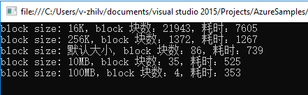

# Block Blob 读取速度慢

## 问题描述

使用 Azure Block Blob 存储事件日志文件，在读取文件时速度慢。

## 问题分析

块 Blob 由块组成。每个块可以是不同的大小，最大为 100MB (对于 2016-05-31 之前 REST 版本的请求为 4MB )，块 Blob 最多可以包含 50,000 块。在上传 Blob 时，我们可以设置单个 Block Blob 块的大小，但是如果每个块的大小设置的太小，就会产生大量的 Block Blob 块，在读取时由于需要进行大量的块映射，就会影响 Block Blob 的读取效率。

## 示例分析

例如：将本地文件（342MB）以不同的尺寸（分别设置单个 blob 块为 16KB, 256KB, 默认大小（本文使用的 SDK 版本为 WindowsAzure.Storage 8.6.0, 默认为 4MB ），10MB, 100MB）分解成块，然后上传到 Block Blob。读取 Block Blob 时，通过代码或者检查日志方式检查响应时间。

分块上传代码如下：
```
TimeSpan backOffPeriod = TimeSpan.FromSeconds(2);
int retryCount = 1;
//设置请求选项
BlobRequestOptions requestoptions = new BlobRequestOptions()
{
    SingleBlobUploadThresholdInBytes = 1024 * 1024 * 10, //10MB
    ParallelOperationThreadCount = 12,
    RetryPolicy = new ExponentialRetry(backOffPeriod, retryCount),
};

CloudStorageAccount account = CloudStorageAccount.Parse(CloudConfigurationManager.GetSetting("StorageConnectionString"));
CloudBlobClient blobclient = account.CreateCloudBlobClient();
//设置客户端默认请求选项
blobclient.DefaultRequestOptions = requestoptions;
CloudBlobContainer blobcontainer = blobclient.GetContainerReference("uploadfiles");
blobcontainer.CreateIfNotExists();
//文件路径，文件大小117MB
string sourcePath = @"D:\bigfiles\bigfiles.zip";
CloudBlockBlob blockblob = blobcontainer.GetBlockBlobReference("Images_16K");
blockblob.DeleteIfExists();
var item = blockblob.Properties.LeaseDuration;

//设置单个块 Blob 的大小（分块方式）为 16KB
blockblob.StreamWriteSizeInBytes = 1024 * 16;

blockblob.Properties.CacheControl = "no-store";
try
{
    Console.WriteLine("uploading");
    //使用 Stopwatch 查看上传时间
    var timer = System.Diagnostics.Stopwatch.StartNew();
    using (var filestream = System.IO.File.OpenRead(sourcePath))
    {
        blockblob.UploadFromStream(filestream);
    }
    timer.Stop();

    Console.WriteLine("block size: 16K，耗时：" + timer.ElapsedMilliseconds);
}
catch (Exception e)
{
    Console.WriteLine(e.Message);
}
```
读取 Block Blob 代码如下:
```
CloudStorageAccount account = CloudStorageAccount.Parse(CloudConfigurationManager.GetSetting("StorageConnectionString"));


CloudBlobClient blobclient = account.CreateCloudBlobClient();
CloudBlobContainer blobcontainer = blobclient.GetContainerReference("uploadfiles");
blobcontainer.CreateIfNotExists();

var timer1 = System.Diagnostics.Stopwatch.StartNew();
CloudBlockBlob blob_16k = blobcontainer.GetBlockBlobReference("Images_16K");
blob_16k.FetchAttributes();
var item1 = blob_16k.DownloadBlockList();
timer1.Stop();
Console.WriteLine("block size: 16K，block 块数：" + item1.Count() + "，耗时：" + timer1.ElapsedMilliseconds);
```

代码执行结果如下（时间为毫秒）：



> [!Note] 使用以上代码获取的时间是执行请求操作的总时间，包含网络延迟的时间。

通过 [Azure 门户](https://portal.azure.cn/)[启用存储监视](https://docs.azure.cn/storage/common/storage-monitor-storage-account)，可以在存储日志中获取存储执行请求操作的执行时间（不包括网络延迟时间）。

截取部分日志信息如下，在 Http 状态码之后的两个数字为执行请求操作的总时间，第一个包括读取传入请求的时间并将响应发送给请求者，第二个不包括网络延迟：


有关存储日志格式的详细信息，请参阅[这篇文章](https://docs.microsoft.com/rest/api/storageservices/Storage-Analytics-Log-Format?redirectedfrom=MSDN)

通过测试输出结果以及存储日志，我们可以看出，对于同一文件，如果单个 Blob 块的的尺寸越小，分解后的块数越多，读取时花费的时间也就越长。

## 方案建议

1. 在使用 Block Blob 存储日志文件时，建议每隔一段时间收集一下日志，然后存储到 Block Blob 。

2. 在设置每个 Blob 块的的尺寸时，网速的好坏也会影响读取的性能，如果网速好的话，建议可以设置较大的值（最大值不超过100MB），如果网速不好的话，可以减小这个值。


    