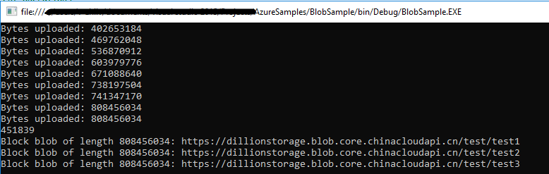

# 上传大文件到 Azure 存储块 Blob 

## 相关概念

Azure 存储提供三种类型的 Blob：块 Blob、页 Blob 和追加 Blob。其中，块 Blob 特别适用于存储短的文本或二进制文件，例如文档和媒体文件。

块 Blob 由块组成。每个块可以是不同的大小，最大为 100MB (对于2016-05-31 之前 REST 版本的请求为4 MB)，块 Blob 最多可以包含 50,000 块。因此，块 Blob 的最大大小约为 4.75 TB (100MB X 50,000块)。对于2016-05-31之前的 REST 版本，块blob的最大大小约为 195 GB（4 MB X 50,000块），更多详细信息，请参阅[这篇文章](https://docs.microsoft.com/rest/api/storageservices/understanding-block-blobs--append-blobs--and-page-blobs)

在上传文件到 Azure Blob 存储时，Azure 支持两种方式，整体上传和分块上传。存储客户端默认使用 [SingleBlobUploadThresholdInBytes](https://docs.microsoft.com/dotnet/api/microsoft.windowsazure.storage.blob.blobrequestoptions.singleblobuploadthresholdinbytes?view=azure-dotnet) 属性设置单个 Blob 上传最大值为 32 MB（可设置范围在 1MB ~ 256MB），使用 [StreamWriteSizeInBytes](https://docs.microsoft.com/dotnet/api/microsoft.windowsazure.storage.blob.cloudblockblob.streamwritesizeinbytes?view=azure-dotnet) 设置单个块 blob 的大小(范围在 16KB ~ 100 MB)。

当上传到块 Blob 的文件小于等于 SingleBlobUploadThresholdInBytes 属性的值时(对于2016-05-31 之前 REST 版本, 请求不大于 64 MB)，则可以调用 PutBlob 完整的上传 Blob ，更多详细信息，请参考：[PutBlob](https://docs.microsoft.com/rest/api/storageservices/put-blob)；

当上传的块 Blob 的文件大于 SingleBlobUploadThresholdInBytes 属性的值时，存储客户端会根据 StreamWriteSizeInBytes 的值将文件分解成块, 采用分块上传的方式上传文件，更多详细信息，请参考[PubBlobList](https://docs.microsoft.com/rest/api/storageservices/put-block-list)。

例如： 设置 SingleBlobUploadThresholdInBytes 为：10MB , StreamWriteSizeInBytes 为：5MB，当上传文件小于等于 10MB 时，可以用一个 PutBlob 将文件整体上传；当文件大于 10 MB 时，客户端会将文件按照 StreamWriteSizeInBytes 属性设置的值，将文件切块， 然后使用 PutBlobList 上传。

本文主要使用以下两种方式上传大文件到 Blob 存储。

* [使用 .NET Storage SDK 上传文件](#netsdk)

* [使用 Microsoft Azure Storage Data Movement Library 上传文件](#datamovement)

## 场景

上传本地文件到 Azure Blob 存储，文件大小：771MB

## <a id="netsdk"></a>使用 .NET Storage SDK 上传文件

代码如下：

```
    TimeSpan backOffPeriod = TimeSpan.FromSeconds(2);
    int retryCount = 1;
    // 设置上传选项：设置单块大小，并发上传的块数
    BlobRequestOptions bro = new BlobRequestOptions()
    {
        SingleBlobUploadThresholdInBytes = 1024 * 1024 * 100, //
        ParallelOperationThreadCount = 12, 
        RetryPolicy = new ExponentialRetry(backOffPeriod, retryCount),
    };

    CloudStorageAccount account = CloudStorageAccount.Parse(CloudConfigurationManager.GetSetting("StorageConnectionString"));
    CloudBlobClient blobclient = account.CreateCloudBlobClient();
    CloudBlobContainer blobcontainer = blobclient.GetContainerReference("test");
    blobcontainer.CreateIfNotExists();

    string sourcePath = @"D:\Documents.zip";
    CloudBlockBlob blockblob = blobcontainer.GetBlockBlobReference("test1");

    // 设置每个块 Blob 的大小
    blockblob.StreamWriteSizeInBytes = 1024 * 1024 * 50;
    try
    {
        Console.WriteLine("uploading");
        // 使用 Stopwatch 查看上传所需时间
        var watch1 = System.Diagnostics.Stopwatch.StartNew();
        using (var filestream = System.IO.File.OpenRead(sourcePath))
        {
            blockblob.UploadFromStream(filestream);
        }
        watch1.Stop();

        Console.WriteLine(watch1.ElapsedMilliseconds);
        Console.WriteLine("Upload Successful");
    }
    catch (Exception e)
    {
        Console.WriteLine(e.Message);
    }
```

## <a id="datamovement"></a>使用 Microsoft Azure Storage Data Movement 类库上传文件

[Microsoft Azure Storage Data Movement](https://github.com/Azure/azure-storage-net-data-movement) 主要用于高性能上传，下载和复制Azure存储Blob和文件。 这个库是基于 [AzCopy](https://docs.azure.cn/storage/common/storage-use-azcopy?toc=%2fstorage%2fblobs%2ftoc.json) 为核心的数据移动框架。

### 前提条件

- .NET Framework 4.5 or above

- Netstandard2.0

代码如下：
```
    CloudStorageAccount account = CloudStorageAccount.Parse(CloudConfigurationManager.GetSetting("StorageConnectionString"));
    CloudBlobClient blobclient = account.CreateCloudBlobClient();
    CloudBlobContainer blobcontainer = blobclient.GetContainerReference("test");
    blobcontainer.CreateIfNotExists();

    // 获取文件路径
    string sourcePath = @"D:\Documents.zip";
    CloudBlockBlob destBlob = blobcontainer.GetBlockBlobReference("test3");
    // 设置并发操作的数量。
    TransferManager.Configurations.ParallelOperations = 64;
    // 设置单块 blob 的大小，它必须在4MB到100MB之间，并且是4MB的倍数，默认情况下是 4MB
    TransferManager.Configurations.BlockSize = 64 * 1024 * 1024;
    // 设置传输上下文并跟踪上传进度
    var context = new SingleTransferContext();
    UploadOptions uploadOptions = new UploadOptions
    {
        DestinationAccessCondition = AccessCondition.GenerateIfExistsCondition()
    };
    context.ProgressHandler = new Progress<TransferStatus>(progress =>
    {
        //显示上传进度
        Console.WriteLine("Bytes uploaded: {0}", progress.BytesTransferred);
    });
    // 使用 Stopwatch 查看上传所需时间
    var watch2 = System.Diagnostics.Stopwatch.StartNew();
    // 上传 Blob
    TransferManager.UploadAsync(sourcePath, destBlob, uploadOptions, context, CancellationToken.None).Wait();
    watch2.Stop();
    Console.WriteLine(watch2.ElapsedMilliseconds);
```

截图如下：

