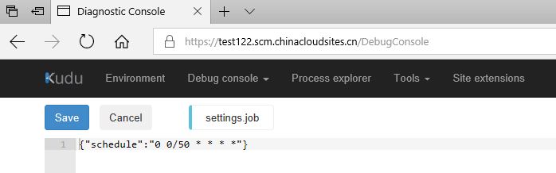

# 如何通过 setting.job 更改计划 Web 作业的启动时间

## 问题描述

通过 settings.job 可以配置计划 WebJobs 的启动时间，在 WebJobs 部署之后如何更改 WebJobs 的启动时间。

## 解决办法

下载网站的发布配置文件，从中获取用户名，密码。


将下列方法中的 <site_name> 替换为网站名称， <user_name> 替换为用户名， <password> 替换为密码。

1. 通过 Kudu 修改 settings.job 文件。

    使用以下 URL: https://<site_name>.scm.chinacloudsites.cn 登录到 Kudu 。

    导航到： D:\home\site\wwwroot\app_data\jobs\triggered\<job_name>\bin\Debug> , 找到 settings.job 文件。

    修改 settings.job 中的 CRON 表达式， 例如：若要每 50 分钟触发一次 WebJobs ，可以改为：

    ```
    json
    {
        "schedule": "0 */50 * * * *"
    }
    ```

    截图如下：

    

2. 通过调用 WebJobs API 修改 settings.job 配置。

    a. 使用 C# 调用 WebJobs API , 代码如下：

    ```
    HttpClient client = new HttpClient();
    // the creds from my .publishsettings file
    var byteArray = Encoding.ASCII.GetBytes("<username>:<password>");
    client.DefaultRequestHeaders.Authorization = new AuthenticationHeaderValue("Basic", Convert.ToBase64String(byteArray));
    var content = new StringContent("{\"schedule\": \"0 0/50 * * * *\"}", Encoding.UTF8, "application/json");
    // POST to the run action for my job
    var response = await client.PutAsync("https://<site_name>.scm.chinacloudsites.cn/api/triggeredwebjobs/<job_name>/settings", content);
    ```

    b. 使用 Postman 调用 WebJobs API 。

    URL：
    ```
    https://<username>:<password>@<site_name>.scm.chinacloudsites.cn/api/triggeredwebjobs/<job_name>/settings
    ```

    截图如下：

    

    c. 使用 Windows Powershell 调用 WebJobs API, 代码如下：

    ```
    PS C:\Users\dillion> $username = "`<username>"
    PS C:\Users\dillion> $password = "<password>"
    PS C:\Users\dillion> $base64AuthInfo = [Convert]::ToBase64String([Text.Encoding]::ASCII.GetBytes(("{0}:{1}" -f $username ,$password)))
    PS C:\Users\dillion> $contentType='application/json'
    PS C:\Users\dillion> $data= @{schedule='*/30 * * * * *'}
    PS C:\Users\dillion> $body = $data | ConvertTo-JSON
    PS C:\Users\dillion> $apiUrl = "https://<site_name>.scm.chinacloudsites.cn/api/triggeredwebjobs/<job_name>/settings"
    PS C:\Users\dillion> Invoke-RestMethod -Uri $apiUrl -Headers @{Authorization=("Basic {0}" -f $base64AuthInfo)} -Method Put -Body $body -ContentType $contentType
    ```

    

    修改后可以使用 Kudu 查看修改后的结果。

## 参考文档

[通过 cron 表达式计划 Azure Web 作业](http://blog.amitapple.com/post/2015/06/scheduling-azure-webjobs/#.Wf_ULNeWaM9)

[创建的 WebJobs 无法按照 CRON 的设置来启动](https://docs.azure.cn/articles/azure-operations-guide/app-service-web/aog-web-apps-qa-webjob-cron-boot-error)

[Web Job API](https://github.com/projectkudu/kudu/wiki/WebJobs-API)