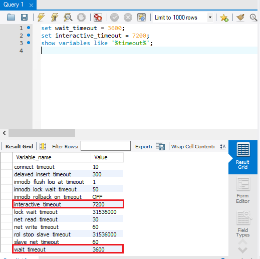

# 如何解决 MySQL DataBase on Auzre 连接被终止的问题

## 问题描述

在执行 mysql 查询语句的过程中，由于查询时间过长导致 MySQL 数据库连接被终止。

## 问题分析

造成这个问题的原因，通常有以下两点：

1. mysql 语句执行时间超过 MySQL DataBase on Auzre 的 wait_timeout 和 interactive_timeout 时间。

    默认情况下，MySQL DataBase on Auzre 实例的 wait_timeout 时间为 120s （可选范围为 60~240s ）, interacive_timeout 时间最大为 1800s。具体服务器参数信息，请参考[定制MySQL Database on Azure服务器参数](https://docs.azure.cn/zh-cn/mysql/mysql-database-advanced-settings)。

2. MySQL 客户端闲置时间多长，被 Azure 流量管理器终结，这个默认时间为 4 分钟（240s）。

## 解决方案

#### 通过 [Azure 门户](https://portal.azure.cn) 修改 MySQL DataBase on Azure 服务器参数，优化查询语句，使查询在设置时间内完成。

修改服务器参数，如图所示：


#### 设置会话级别 wait_timeout 和 interactive_timeout 时间。

通过[了解更多 MySQL 参数信息](https://dev.mysql.com/doc/refman/5.5/en/server-system-variables.html#sysvar_wait_timeout), 我们可以设置会话级别的 wait_timeout 和 interactive_timeout, 超过 240s, 1800s 的限制。

例如，通过 [MySQL Workbench 连接到 MySQL DataBase on Azure](https://docs.microsoft.com/azure/mysql/connect-workbench), 使用以下命令修改 wait_timeout 和 interactive_timeout 时间：

```
set wait_timeout = 3600;
set interactive_timeout = 3600;
show variables like 'interactive_timeout';
show variables like 'wait_timeout';
```

如图所示：



#### 通过设置 ”心跳” 的方式，防止被 Azure 流量管理器终结。

如果设置 wait_timeout 和 interactive_timeout 时间超过 240s, 1800s 的限制，可以通过以下方式设置“心跳”，避免连接被 Azure 流量管理器终结。

* Windows 系统

通过运行，输入 “regedit”，打开注册表，在该目录下找到 KeepAliveTime （如果没有则添加，新建时设置数据类型为 REG_DWORD （32 位））,

`HKEY_LOCAL_MACHINE\SYSTEM\CurrentControlSet\Services\Tcpip\Parameters\`

修改 KeepAliveTime 时，值类型选十进制，输入值：60000。

> Note
>
>这里时间为毫秒。修改完之后需要重启生效。

* Linux 系统

需要修改 4 个操作系统的 keepalive 参数：

1. tcp_keepalive_probes : 在认定连接失效之前，已发送的 TCP keepalive 探测包的个数。使用该值乘以 tcp_keepalive_intvl 表明连接在发送了 keepalive 之后可以保持多长时间无需做出回应。

2. tcp_keepalive_time : 最后一次数据交换到 TCP 发送第一个保活探测包的间隔，即允许的持续空闲时长，也就是每次正常发送心跳的周期。

3. tcp_keepalive_intvl : 发送探测包的间隔周期。

4. tcp_retries2 ：在决定终止该连接之前，数据包要重试发送的最大次数

使用以下命令修改:

```
echo "6" > /proc/sys/net/ipv4/tcp_keepalive_time
echo "1" > /proc/sys/net/ipv4/tcp_keepalive_intvl
echo "10" > /proc/sys/net/ipv4/tcp_keepalive_probes
echo "3" > /proc/sys/net/ipv4/tcp_retries2
```

> Note
>
> tcp_keepalive_time 和 tcp_keepalive_intvl 值以秒表示。 要在系统重新启动后保留这些值，必须将它们添加到 /etc/sysctl.conf 文件中。
