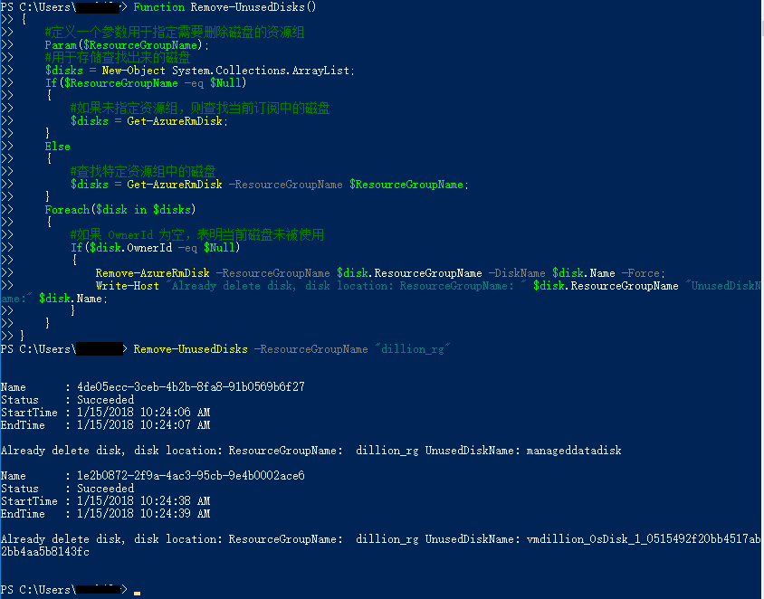
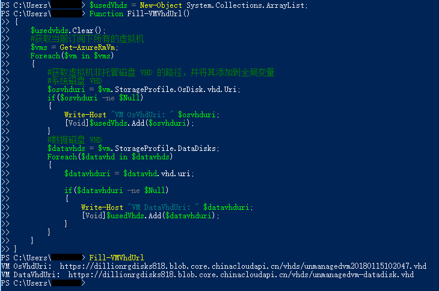
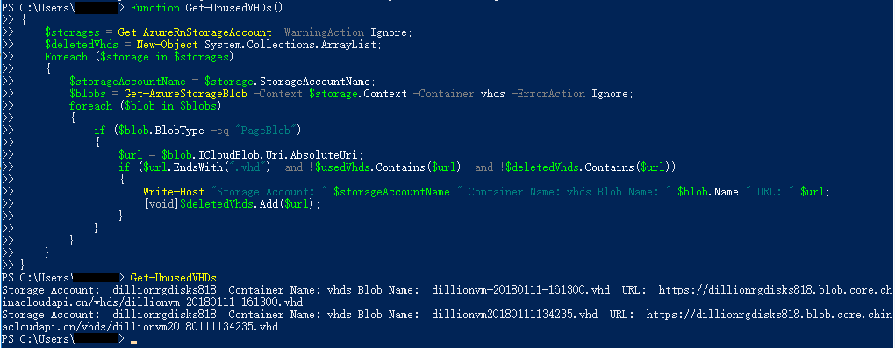
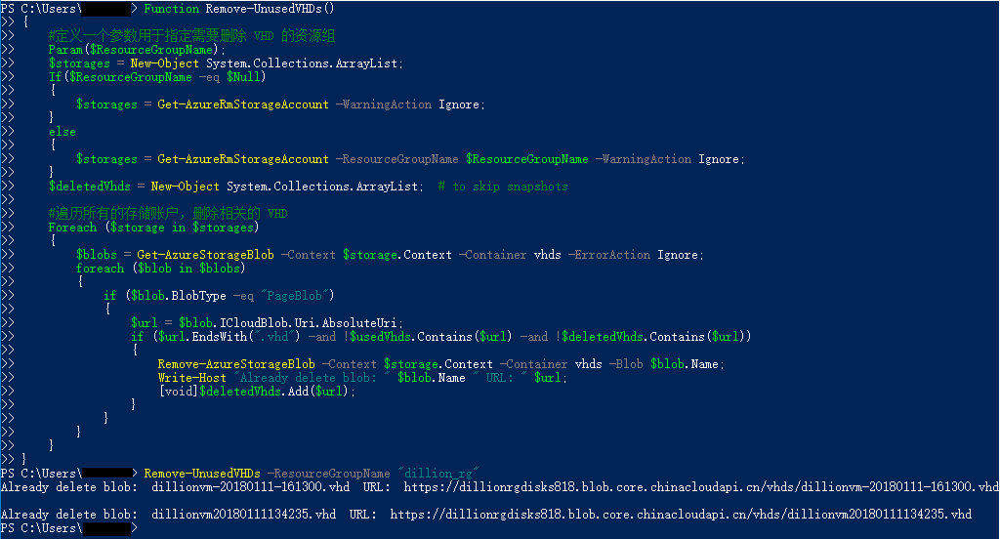

# 如何查找并删除未被使用的托管磁盘和 VHD

删除虚拟机时，与该虚拟机相关联的操作系统盘和数据磁盘不会被删除，最终会留在 Azure 存储账户中，从而导致用户继续承担这些磁盘的存储费用。

> [!Warning]
> 删除托管磁盘和 VHD 时，防止重要数据丢失。

本文主要介绍了如何使用 PowerShell 查找并删除未被使用的托管磁盘和 VHD 。主要包括以下内容：

* 查找并删除未被使用的托管磁盘
* 查找并删除未被使用的非托管磁盘 VHD

## 查找并删除未被使用的托管磁盘

通过检查托管磁盘的所有者来判断该磁盘是否正在使用，具体操作如下：

1. 获取未被使用的托管磁盘

```
Function Get-UnusedDisks()
{
    $disks = Get-AzureRmDisk;
    foreach ($disk in $disks)
    {
        If($disk.OwnerId -eq $Null)
        {
            Write-Host "ResourceGroupName: " $disk.ResourceGroupName "UnusedDiskName:" $disk.Name;
        }
    }
}
```

执行以上方法，获取当前订阅下所有未被使用的托管磁盘, 如下所示：


2. 删除指定的一块托管磁盘

可以使用以下命令将 `<资源组名称>` 替换成磁盘所在的资源组，将 `<磁盘名称>` 替换为所要删除的磁盘名称，删除指定的一块托管磁盘：

```
Remove-AzureRmDisk -ResourceGroupName "<资源组名称>" -DiskName "<磁盘名称>" -Force;
```

3. 删除指定资源组中未被使用的磁盘

```
Function Remove-UnusedDisks()
{
    #定义一个参数用于指定需要删除磁盘的资源组
    Param($ResourceGroupName);
    #用于存储查找出来的磁盘
    $disks = New-Object System.Collections.ArrayList;
    If($ResourceGroupName -eq $Null)
    {
        #如果未指定资源组，则查找当前订阅中的磁盘
        $disks = Get-AzureRmDisk;
    }
    Else
    {
        #查找特定资源组中的磁盘
        $disks = Get-AzureRmDisk -ResourceGroupName $ResourceGroupName;
    }
    Foreach($disk in $disks)
    {
        #如果 OwnerId 为空，表明当前磁盘未被使用
        If($disk.OwnerId -eq $Null)
        {
            Remove-AzureRmDisk -ResourceGroupName $disk.ResourceGroupName -DiskName $disk.Name -Force;
            Write-Host "Already delete disk, disk location: ResourceGroupName: " $disk.ResourceGroupName "UnusedDiskName:" $disk.Name;
        }
    }
}
```

通过执行以下命令删除特定资源组中的托管磁盘：

```
Remove-UnusedDisks -ResourceGroupName "<资源组名称>"
```

结果如下：



如果想要删除当前订阅中所有的未被使用的托管磁盘，可以不指定资源组，使用以下命令：

```
Remove-UnusedDisks
```

## 查找并删除未被使用的非托管磁盘 VHD

非托管磁盘 VHD 以页 Blob 的方式存储在存储账户中，通过比较 VM 中使用的磁盘 Url 与存储账户中页 blob 的 Url, 可以判断出那些 VHD 是未被使用的，然后进行删除。

> [!Note] 
> 默认情况下，创建新的 VM 时，系统磁盘会存储在存储账户中的 vhds 容器中，为了方便管理 VHD ,建议将所有的 VHD 文件都放在 vhds 容器中方便管理。本文中所有的 VHD 磁盘都放在 vhds 容器中。

具体步骤如下:

1. 定义一个全局变量用于存储当前 VM 正在使用的 VHD 。

```
$usedVhds = New-Object System.Collections.ArrayList; 
```

2. 查找出当前订阅下虚拟机正在使用的 VHD 的绝对路径

将当前订阅下虚拟机正在使用的 VHD 路径存储在全局变量中，方便下一步确认那些 VHD 是正在使用的。

```
Function Fill-VMVhdUrl()
{
    $usedvhds.Clear();
    #获取当前订阅下所有的虚拟机
    $vms = Get-AzureRmVm;
    Foreach($vm in $vms)
    {
        #获取虚拟机非托管磁盘 VHD 的路径，并将其添加到全局变量
        #系统磁盘 VHD
        $osvhduri = $vm.StorageProfile.OsDisk.vhd.Uri;
        if($osvhduri -ne $Null)
        {
            Write-Host "VM OsVhdUri: " $osvhduri;
            [Void]$usedVhds.Add($osvhduri);
        }
        #数据磁盘 VHD
        $datavhds = $vm.StorageProfile.DataDisks;
        Foreach($datavhd in $datavhds)
        {
            $datavhduri = $datavhd.vhd.uri;
            
            if($datavhduri -ne $Null)
            {
                Write-Host "VM DataVhdUri: " $datavhduri;
                [Void]$usedVhds.Add($datavhduri);
            }
        }
    }
}
```

执行以上命令，结果如下：



3. 获取未被使用的 VHD

遍历所有的存储账户，在 vhds 容器中根据 Blob 的文件名和 Url 查找出未被使用的 VHD。

```
Function Get-UnusedVHDs()
{
    $storages = Get-AzureRmStorageAccount -WarningAction Ignore;
    $deletedVhds = New-Object System.Collections.ArrayList;   
    Foreach ($storage in $storages)
    {
        $storageAccountName = $storage.StorageAccountName;
        $blobs = Get-AzureStorageBlob -Context $storage.Context -Container vhds -ErrorAction Ignore;
        foreach ($blob in $blobs)
        {
            if ($blob.BlobType -eq "PageBlob")
            {
                $url = $blob.ICloudBlob.Uri.AbsoluteUri;
                if ($url.EndsWith(".vhd") -and !$usedVhds.Contains($url) -and !$deletedVhds.Contains($url))
                {
                    Write-Host "Storage Account: " $storageAccountName " Container Name: vhds Blob Name: " $blob.Name " URL: " $url;
                    [void]$deletedVhds.Add($url);
                }
            }
        }
    }
}
```

截图如下：



4. 删除指定的 VHD

```
$storage = Get-AzureRmStorageAccount -ResourceGroupName "dillion_rg" -AccountName "dillionrgdisks818";
Remove-AzureStorageBlob -Context $storage.Context -Container vhds -Blob "dillionvm-20180111-173013.vhd"; 
```

5. 删除所有未被使用的 VHD

```
Function Remove-UnusedVHDs()
{
    #定义一个参数用于指定需要删除 VHD 的资源组
    Param($ResourceGroupName);
    $storages = New-Object System.Collections.ArrayList;
    If($ResourceGroupName -eq $Null)
    {
        $storages = Get-AzureRmStorageAccount -WarningAction Ignore;
    }
    else
    {
        $storages = Get-AzureRmStorageAccount -ResourceGroupName $ResourceGroupName -WarningAction Ignore;
    }
    $deletedVhds = New-Object System.Collections.ArrayList;  # to skip snapshots 

    #遍历所有的存储账户，删除相关的 VHD
    Foreach ($storage in $storages)
    {
        $blobs = Get-AzureStorageBlob -Context $storage.Context -Container vhds -ErrorAction Ignore;
        foreach ($blob in $blobs)
        {
            if ($blob.BlobType -eq "PageBlob")
            {
                $url = $blob.ICloudBlob.Uri.AbsoluteUri;
                if ($url.EndsWith(".vhd") -and !$usedVhds.Contains($url) -and !$deletedVhds.Contains($url))
                {
                    Remove-AzureStorageBlob -Context $storage.Context -Container vhds -Blob $blob.Name;
                    Write-Host "Already delete blob: " $blob.Name " URL: " $url;
                    [void]$deletedVhds.Add($url);
                }
            }
        }
    }
}
```

通过执行以下命令删除指定资源组中未被使用的 VHD:

```
Remove-UnusedVHDs -ResourceGroupName "<资源组名称>"
```



如果想要删除该订阅下所有未被使用的 VHD ，可以使用以下命令：

```
Remove-UnusedVHDs 
```