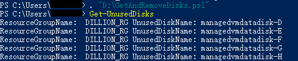
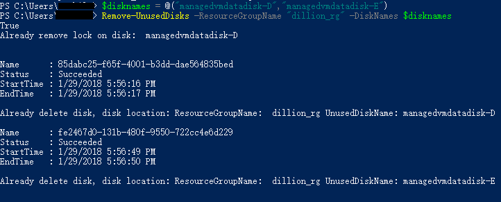
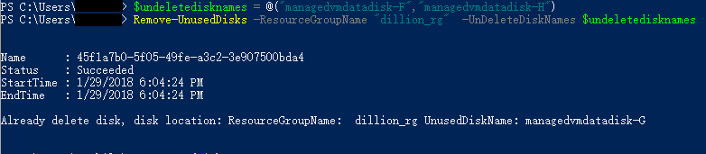
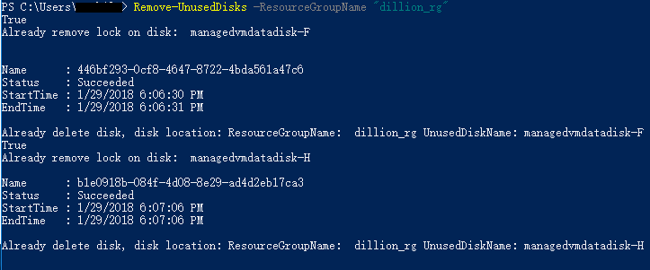
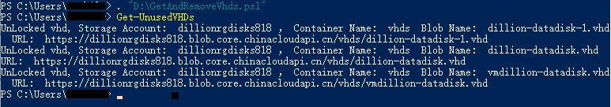
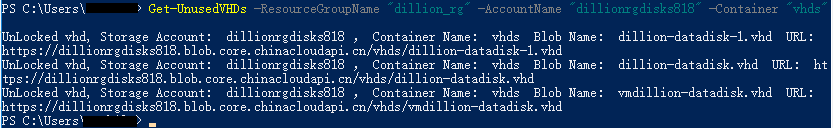
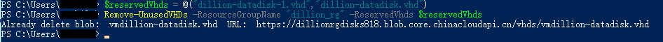
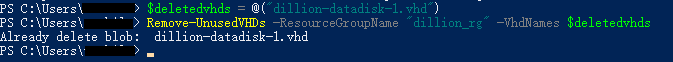
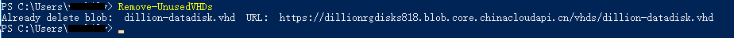

# 如何查找并删除未被使用的托管磁盘或非托管磁盘源 .vhd 文件

在创建虚拟机时，可以选择该虚拟机是用托管磁盘还是非托管磁盘来存储虚拟机的系统磁盘和数据磁盘，有关托管磁盘和非托管磁盘的详细信息，请参考[磁盘存储](https://docs.azure.cn/virtual-machines/windows/about-disks-and-vhds)。

删除虚拟机时，与该虚拟机相关联的操作系统盘和数据磁盘不会被删除，最终会留在 Azure 存储账户中，从而导致用户继续承担这些磁盘的存储费用。

> [!Warning]
> 如果从资源组或存储账户中删除托管磁盘和非托管磁盘源 .vhd 文件，Microsoft 则无法为用户恢复数据。为防止重要数据丢失，请将重要数据在本地备份。

本文主要介绍了如何使用 PowerShell 查找并删除未被使用的托管磁盘和非托管磁盘源 .vhd 文件。主要包括以下内容：

* 查找并删除未被使用的托管磁盘
* 查找并删除未被使用的非托管磁盘源 .vhd 文件

## 查找并删除未被使用的托管磁盘

通过检查托管磁盘的所有者来判断该磁盘是否正在使用。具体实现请下载[相关的 Power Shell 脚本](https://github.com/Dillion132/acn-content/blob/master/C-Articles_for_Jan_part_1/media/aog-virtual-machines-how-to-find-and-delete-unused-disks-and-vhds/GetAndRemoveDisks.ps1)，并执行以下命令：

1. 获取未被使用的托管磁盘

    ```
    # 添加脚本
    . "D:\GetAndRemoveDisks.ps1"
    # 查看订阅下所有未被使用的托管磁盘。
    Get-UnusedDisks
    ```

    执行以上方法，获取当前订阅下所有未被使用的托管磁盘, 如下所示：

    


2. 删除指定的托管磁盘

    可以使用以下命令将 `<资源组名称>` 替换成磁盘所在的资源组，将 `<磁盘名称>` 替换为所要删除的磁盘名称，删除指定的托管磁盘：

    ```
    #数组类型，可以指定多个磁盘
    $disknames = @("<磁盘名称>","<磁盘名称>")
    Remove-UnusedDisks -ResourceGroupName "<资源组名称>" -DiskNames $disknames -Force;
    ```

    

    > [!Note]
    > 在指定磁盘名称时，请确保磁盘名称一致。

3. 删除指定资源组中其他未被使用的托管磁盘，保留指定的磁盘

    > [!Note]
    > 使用该脚本删除磁盘时，会将被 Lock 的磁盘解锁并删除，所以在删除前再次检查是否需要删除，如果需要保留磁盘，请使用下列的代码指定保留磁盘。

    ```
    $undeletedisknames = @("磁盘名称","磁盘名称")
    Remove-UnusedDisks -ResourceGroupName "<资源组名称>" -UnDeleteDiskNames $undeletedisknames 
    ```

    

4. 删除当前订阅中指定资源组中未被使用的托管磁盘，使用以下命令：

    ```
    Remove-UnusedDisks -ResourceGroupName "<资源组名称>"
    ```

    

    > [!Note]
    > 如果不指定资源组，则删除当前订阅下所有未被使用的托管磁盘。

## 查找并删除未被使用的非托管磁盘源 .vhd 文件

非托管磁盘源 .vhd 文件以页 Blob 的方式存储在存储账户中，通过查看页 Blob 的名称来判断是否是源 .vhd 文件，通过检查属性 LeaseState 来判断源文件是否被租用，然后进行删除。具体实现脚本，请[点击查看](https://github.com/Dillion132/acn-content/blob/master/C-Articles_for_Jan_part_1/media/aog-virtual-machines-how-to-find-and-delete-unused-disks-and-vhds/GetAndRemoveVhds.ps1)。

> [!Note] 
> 默认情况下，创建新的 VM 时，系统磁盘会存储在存储账户中的 vhds 容器中，为了方便管理源 .vhd 文件,建议将所有的源 .vhd 文件都放在 vhds 容器中。本文中所有的源 .vhd 文件都放在 vhds 容器中，并且在本文使用的脚本中，默认设置容器名称为 vhds 。

使用以下命令查看或删除相关的源 .vhd 文件:

1. 查看当前订阅下未被使用的源 .vhd 文件

    遍历所有的存储账户，在 vhds 容器中根据 Blob 的文件名和属性查找出未被使用的源 .vhd 文件。

    ```
    # 添加脚本
    . "D:\GetAndRemoveVhds.ps1"
    # 查看订阅下所有未被使用的托管磁盘。
    Get-UnusedVHDs
    ```
    

    也可以使用以下代码指定资源组

    ```
    Get-UnusedVHDs -ResourceGroupName "<资源组名称>" -AccountName "<存储账户名称>" -Container "< Blob 容器名称>"
    ```

    


2. 删除其他的源 .vhd 文件，保留所需的源 .vhd 文件

    > [!Note]
    > 使用该脚本删除源 .vhd 文件时，会将被 Lock 的源 .vhd 文件解锁并删除，所以在删除前再次检查是否需要删除，如果需要保留源 .vhd 文件，请使用下列的代码指定保留源 .vhd 文件。

    ```
    $reservedVhds = @("<源 .vhd 文件 Blob 名称>","<源 .vhd 文件 Blob 名称>")
    Remove-UnusedVHDs -ResourceGroupName "dillion_rg" -ReservedVhds $reservedVhds
    ```

    

3. 删除指定的源 .vhd 文件

    ```
    $deletedvhds = @("<源 .vhd 文件 Blob 名称>")
    Remove-UnusedVHDs -ResourceGroupName "dillion_rg" -VhdNames $deletedvhds
    ```

    

4. 如果不需要删除指定源文件或者保留源文件，可以使用以下命令删除订阅下或者指定资源组中的源 .vhd 文件

    ```
    #删除资源组中的源 .vhd 文件
    Remove-UnusedVHDs -ResourceGroupName "<资源组名称>"
    #删除订阅中的源 .vhd 文件
    Remove-UnusedVHDs 
    ```

    